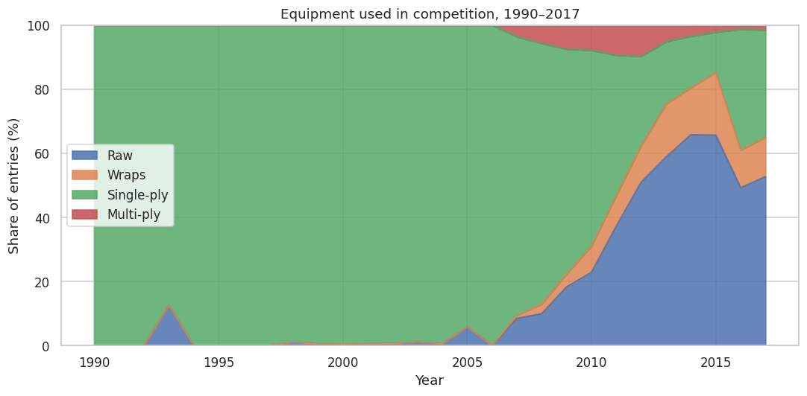
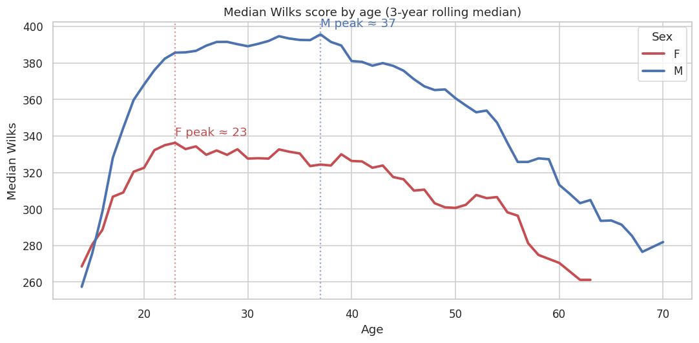

# What Does It Take to Be a Strong Powerlifter? 🏋️

An end-to-end data analytics project on **386,414 real competition results** from the
[OpenPowerlifting](https://www.openpowerlifting.org/) project — covering 8,482 meets across
45 countries from 1974 to 2018.

As a lifter myself, I wanted to answer the questions every gym-goer asks: *when do lifters
peak, how much does bodyweight really matter, and what total would put me in the top 10%?*

📓 **Full analysis:** [`powerlifting_analysis.ipynb`](powerlifting_analysis.ipynb)

## Key findings

1. **Powerlifting boomed after 2010** — and women quadrupled their share of entries, from 6% (1990) to 24% (2017).
2. **The "raw renaissance" is real.** Raw (unequipped) lifting exploded from **0.3% of entries in 2000 to 53% in 2017**, meaning any historical comparison of totals must control for equipment.
3. **Peak strength is a plateau, not a point.** Pound-for-pound strength (Wilks) plateaus from the mid-20s to the late 30s, declining only gradually after 40.
4. **Relative strength falls as bodyweight rises** — classic allometric scaling, and the reason coefficient formulas like Wilks/DOTS exist.
5. **Four demographic features (sex, bodyweight, age, equipment) predict a lifter's total with R² ≈ 0.78** (gradient boosting, MAE ≈ 64 kg). Demographics set the baseline — the unexplained ~22% is where training, technique and genetics live.

| | |
|---|---|
|  |  |

## Bonus: benchmark yourself

The notebook includes percentile tables of raw totals by sex and weight class, plus a lookup
function:

```python
where_do_i_rank("M", 83, 500)
# M, 83 kg, 500 kg total -> 29th percentile of comparable competitors
```

## What the project demonstrates

- **Data cleaning on messy real-world data**: failed attempts stored as negative numbers,
  62% missing ages, >99%-empty columns, implausible bodyweights, disqualified entries
- **Joining relational data** (lifter entries ↔ meet metadata)
- **Exploratory analysis & visualization** (pandas, matplotlib, seaborn)
- **Statistical thinking**: selection bias, cross-sectional vs longitudinal data, why
  normalized metrics (Wilks) exist
- **Machine learning**: linear baseline vs gradient boosting, permutation feature
  importance, honest interpretation of what a model can and cannot explain

## Project structure

```
├── powerlifting_analysis.ipynb   # main analysis (fully executed)
├── data/
│   ├── openpowerlifting.csv      # 386k lifter entries
│   └── meets.csv                 # 8.5k meets (date, federation, country)
├── figures/                      # exported charts
└── requirements.txt
```

## Reproducing

```bash
pip install -r requirements.txt
jupyter notebook powerlifting_analysis.ipynb
```

## Data & license

Data from the [OpenPowerlifting](https://www.openpowerlifting.org/) project, released to the
public domain. This snapshot ends in early 2018; the live dataset (3M+ entries) is available
at [openpowerlifting.gitlab.io/opl-csv](https://openpowerlifting.gitlab.io/opl-csv/) —
extending this analysis to within-lifter longitudinal progression is the natural next step.
